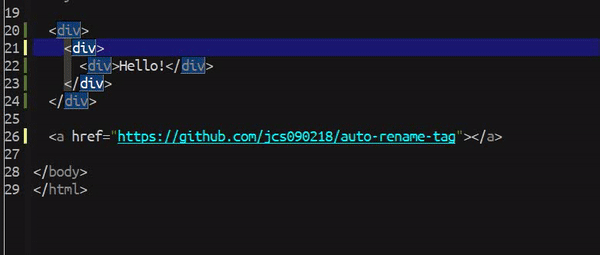

# auto-rename-tag #

Automatically rename paired HTML/XML tag. <br/><br/>


## Usage ##
Enable for all buffers.
```
(global-auto-rename-tag-mode t)
```
Or you can just enable in specific buffer you want.
```
(auto-rename-tag-mode t)
```


## Screenshot ##



## Contribution ##
If you would like to contribute to this project. You may either
clone and make pull request to this repository. Or you can
clone the project and make your own branch of this tool. Any
methods are welcome!
